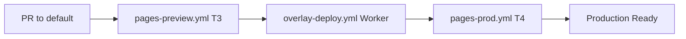

# Workflow Matrix Report - RunArtFoundry/runart-foundry
**Generated**: 2025-10-13T20:47:41Z  
**Analysis Type**: CI/CD pipeline audit

## Workflow Distribution by Branch

### Default Branch (`chore/bootstrap-git`) - 13 workflows
✅ **Complete workflow suite** - includes all critical infrastructure

### Main Branch (`main`) - 9 workflows  
⚠️ **Missing overlay infrastructure** - lacks critical deployment workflows

## Workflow Inventory & Analysis

| Workflow | Default | Main | workflow_dispatch | Triggers | Secrets Required | Purpose |
|----------|---------|------|------------------|----------|-----------------|----------|
| `overlay-deploy.yml` | ✅ | ❌ | ✅ | workflow_dispatch, PR→main | CLOUDFLARE_*, ACCESS_* | **CRITICAL** - Overlay Worker deployment |
| `pages-preview.yml` | ✅ | ❌ | ✅ | PR, workflow_dispatch | CLOUDFLARE_*, CF_PROJECT_NAME | **CRITICAL** - Preview T3 testing |  
| `pages-preview2.yml` | ✅ | ❌ | ✅ | PR, workflow_dispatch | CLOUDFLARE_* | Preview alternative |
| `pages-prod.yml` | ✅ | ❌ | ✅ | workflow_dispatch | CLOUDFLARE_*, ACCESS_* | **CRITICAL** - Production T4 testing |
| `briefing_deploy.yml` | ✅ | ✅ | ✅ | workflow_dispatch | CF_API_TOKEN, CF_ACCOUNT_ID | App deployment |
| `ci.yml` | ✅ | ✅ | ❌ | push, PR | GITHUB_TOKEN | Basic CI |
| `pages-deploy.yml` | ✅ | ✅ | ❌ | push to main | CF_API_TOKEN | Production deploy |
| `docs-lint.yml` | ✅ | ✅ | ✅ | push, workflow_dispatch | None | Documentation validation |
| `env-report.yml` | ✅ | ✅ | ✅ | workflow_dispatch | None | Environment diagnostics |
| `status-update.yml` | ✅ | ✅ | ✅ | workflow_dispatch | None | Status reporting |
| `structure-guard.yml` | ✅ | ✅ | ✅ | workflow_dispatch | None | Repository structure validation |
| `pages-preview-guard.yml` | ✅ | ✅ | ✅ | workflow_dispatch | None | Preview environment guards |
| `auto-open-pr-on-deploy-branches.yml` | ✅ | ✅ | ❌ | push to deploy/** | GITHUB_TOKEN | Auto-PR creation |

## Critical Infrastructure Gaps

### 🔴 Missing in Main Branch (High Risk)
1. **`overlay-deploy.yml`** - Core overlay Worker deployment infrastructure
2. **`pages-preview.yml`** - T3 authentication testing capability  
3. **`pages-preview2.yml`** - Alternative preview deployment
4. **`pages-prod.yml`** - T4 production testing capability

**Impact**: If `main` becomes default, overlay infrastructure would be lost.

## Secret Dependencies Analysis

### Cloudflare Infrastructure Secrets (Required)
- `CLOUDFLARE_API_TOKEN` - Used in 6 workflows
- `CLOUDFLARE_ACCOUNT_ID` - Used in 6 workflows  
- `CF_PROJECT_NAME` - Pages project identification
- `CF_API_TOKEN` / `CF_ACCOUNT_ID` - Alternative naming in briefing deploy

### Overlay-Specific Secrets (Critical)
- `ACCESS_CLIENT_ID` - Service token authentication
- `ACCESS_CLIENT_SECRET` - Service token authentication
- `RUNART_ROLES_KV_PREVIEW` - KV namespace ID for preview
- `RUNART_ROLES_KV_PROD` - KV namespace ID for production

## Workflow Health Assessment

### ✅ Well-Configured Workflows
- **Dispatch Capability**: 10/13 workflows support manual execution
- **Secret Validation**: Most workflows include preflight secret checks
- **Error Handling**: Comprehensive validation in critical paths

### ⚠️ Configuration Concerns
1. **Mixed Naming**: Some workflows use `CF_*` vs `CLOUDFLARE_*` secrets
2. **Base Branch Targeting**: `overlay-deploy.yml` targets `main` but missing from `main`
3. **Redundancy**: `pages-preview.yml` vs `pages-preview2.yml` (similar functionality)

## Pull Request Trigger Analysis

### Branches Monitored for PRs
- `develop` (legacy development branch)
- `main` (standard main branch)  
- `deploy/**` (deployment branches)
- `chore/bootstrap-git` (current default)

**Issue**: Mixed targeting creates confusion about which branch is authoritative.

## Deployment Strategy Assessment

### Current Setup (Default Branch)

### Missing Setup (Main Branch)  

```mermaid
graph LR
    A[PR to main] --> B[❌ No T3 capability]
    B --> C[❌ No overlay deployment]
    C --> D[❌ No T4 testing]
    D --> E[❌ Broken pipeline]
```

## Migration Requirements

### To Promote Main as Default
**Required Actions:**
1. Copy 4 missing workflows to `main` branch
2. Update secret references if needed
3. Test full T3/T4 pipeline on `main`
4. Update PR base targeting

### To Maintain Current Default  
**Required Actions:**
1. Standardize secret naming across workflows
2. Consider renaming `chore/bootstrap-git` to `main`
3. Archive old `main` branch after sync

## Recommendations

### 🎯 Primary Recommendation: **Sync Infrastructure to Main**
1. **High Priority**: Merge `sync/bootstrap-git-to-main` PR to copy workflows
2. **Medium Priority**: Test full T3/T4 pipeline on `main`  
3. **Low Priority**: Promote `main` as default after validation

### 🔧 Workflow Improvements
1. **Standardize Secret Names**: Use consistent `CLOUDFLARE_*` prefixes
2. **Consolidate Preview Workflows**: Choose between preview vs preview2
3. **Add Branch Protection**: Require workflow success for merges

---
*Next Analysis: Default vs Main diff analysis for infrastructure conflicts*