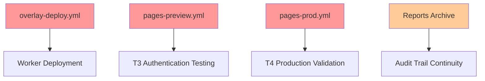
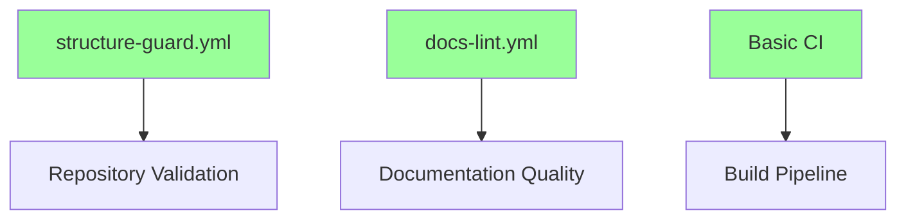

# Default vs Main Branch Diff Analysis - RunArtFoundry/runart-foundry  
**Generated**: 2025-10-13T20:47:41Z  
**Analysis Type**: Infrastructure conflict assessment

## Branch Comparison Overview

### Merge Analysis
- **Default Branch**: `chore/bootstrap-git` 
- **Target Branch**: `main`
- **Merge Base**: `ea2e72bb` (common ancestor)
- **Merge Status**: ⚠️ **CONFLICTS DETECTED**

## Infrastructure Gaps Summary

### 🔴 Critical Missing Components in Main

#### Workflows (11 missing)
| Workflow | Impact | Risk Level |
|----------|--------|------------|
| `overlay-deploy.yml` | **CRITICAL** - Core overlay infrastructure | 🔴 HIGH |
| `pages-preview.yml` | **CRITICAL** - T3 authentication testing | 🔴 HIGH |
| `pages-prod.yml` | **CRITICAL** - T4 production testing | 🔴 HIGH |
| `pages-preview2.yml` | Alternative preview deployment | 🟡 MEDIUM |
| `auto-open-pr-on-deploy-branches.yml` | PR automation | 🟡 MEDIUM |
| `briefing_deploy.yml` | App deployment pipeline | 🟡 MEDIUM |
| `ci.yml` | Basic CI pipeline | 🟡 MEDIUM |
| `pages-deploy.yml` | Production deployment | 🟡 MEDIUM |
| `pages-preview-guard.yml` | Preview environment protection | 🟢 LOW |
| `env-report.yml` | Environment diagnostics | 🟢 LOW |
| `status-update.yml` | Status reporting | 🟢 LOW |

#### Reports & Documentation Infrastructure (140+ files)
- Complete `apps/briefing/_reports/` tree missing in `main`
- CI documentation `apps/briefing/docs/internal/briefing_system/ci/` missing
- Historical testing evidence (T1-T5 results) unavailable
- KV roles audit trails missing

## Conflict Analysis

### 🔴 Merge Conflicts Detected

#### `briefing_deploy.yml` Conflict
**Nature**: Workflow name and logic differences
```diff
<<<<<<< .our (main)
name: Briefing — Deploy to Cloudflare Pages
=======
name: Briefing Deploy (LEGACY)
on:
  workflow_dispatch:
    inputs:
      confirm_legacy:
>>>>>>> .their (default)
```

**Analysis**: 
- Main has simplified version  
- Default has legacy protection mechanism
- Resolution required before merge

### 🟡 Modified Files Requiring Review
- `.github/workflows/structure-guard.yml` - structural validation differences

## Migration Scenarios Assessment

### Scenario A: Promote Main as Default (BLOCKED)
**Current Status**: ❌ **Cannot proceed due to conflicts**

**Required Pre-work**:
1. Resolve `briefing_deploy.yml` conflict
2. Copy 11 missing workflows to `main`
3. Migrate reports infrastructure  
4. Test full T3/T4 pipeline on `main`

**Estimated Effort**: 🔴 **High** (2-3 days)  
**Risk**: High - Complex infrastructure migration

### Scenario B: Keep Current Default, Sync to Main (RECOMMENDED)
**Current Status**: ✅ **Feasible with conflict resolution**

**Required Actions**:
1. Resolve workflow conflicts (30 min)
2. Merge default → main via PR
3. Clean up duplicate/legacy workflows
4. Maintain current infrastructure

**Estimated Effort**: 🟢 **Low** (2-4 hours)  
**Risk**: Low - Additive changes only

## Data Migration Impact

### Reports Archive (140+ files)
- **Historical Value**: High - contains T1-T5 testing evidence
- **Storage Impact**: ~2MB of structured test data
- **Dependencies**: Referenced in documentation, audit trails

### CI Documentation
- **082 Documentation**: Critical governance documentation
- **Plan Files**: Phase-based implementation guides  
- **Access Audit**: Cloudflare Access configuration history

## Infrastructure Dependencies

### Missing in Main Branch


### Available in Main Branch


## Security & Compliance Implications

### Workflow Secrets Usage
- **Default Branch**: Full secret matrix (Cloudflare + Access + KV)
- **Main Branch**: Partial secret usage (missing overlay secrets)

### Branch Protection Impact  
- **Current**: Main is protected, default is not
- **Risk**: Force-push possible on active development branch

## Resolution Strategy

### 🎯 Recommended Path: **Sync Default → Main**

#### Phase 1: Conflict Resolution (30 min)
1. Resolve `briefing_deploy.yml` conflict
2. Choose between legacy protection vs simplified workflow
3. Test resolution on feature branch

#### Phase 2: Infrastructure Sync (2 hours)  
1. Merge `sync/bootstrap-git-to-main` PR
2. Verify all workflows copied successfully
3. Run basic CI validation on `main`

#### Phase 3: Validation (1 hour)
1. Test T3/T4 pipeline on `main` branch
2. Verify reports structure migrated
3. Confirm secret access working

#### Phase 4: Default Migration (30 min)
1. Set `main` as repository default
2. Update PR targets where needed  
3. Archive `chore/bootstrap-git` after transition

### ⚠️ Alternative: Keep Current Default
If conflicts prove complex:
1. Rename `chore/bootstrap-git` → `main`
2. Archive old `main` branch
3. Update documentation to reflect naming

## Risk Mitigation

### Pre-Migration Checklist
- [ ] Backup current `main` branch state
- [ ] Test conflict resolution on feature branch
- [ ] Verify all secrets accessible from `main`
- [ ] Confirm T3/T4 pipeline compatibility

### Rollback Plan
- Revert default branch setting via GitHub UI
- Restore `chore/bootstrap-git` as active development branch
- Re-target PRs if needed

---
*Next Analysis: CI Health Assessment - overlay deployment status*