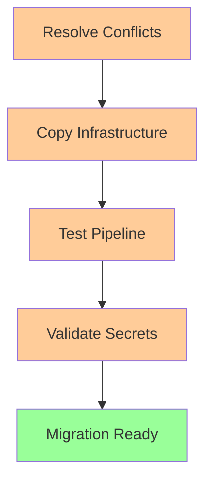

# Governance Migration Plan - RunArtFoundry/runart-foundry
**Generated**: 2025-10-13T20:47:41Z  
**Analysis Type**: Strategic migration planning (non-destructive)

## Executive Summary

Based on comprehensive analysis, two viable paths exist for repository standardization. **Path B (Sync Default → Main)** is strongly recommended due to lower risk and faster execution.

## Migration Path Comparison

### Path A: Promote Main as Default Branch ❌ **BLOCKED**
**Status**: Not viable without significant pre-work  
**Effort**: 🔴 High (2-3 days)  
**Risk**: 🔴 High  

#### Blockers
1. **Merge Conflicts**: `briefing_deploy.yml` conflicts require manual resolution
2. **Infrastructure Gap**: 11 workflows + 140+ files missing in `main`
3. **Testing Required**: Full T3/T4 pipeline validation needed on `main`
4. **Secret Dependencies**: Overlay infrastructure secrets need verification

#### Required Pre-work (if pursued)


### Path B: Sync Default → Main ✅ **RECOMMENDED**
**Status**: Viable with minor conflict resolution  
**Effort**: 🟢 Low (2-4 hours)  
**Risk**: 🟢 Low  

#### Advantages
- ✅ Additive changes (no data loss)
- ✅ Preserves working overlay infrastructure  
- ✅ Maintains T3/T4 pipeline continuity
- ✅ Single conflict resolution required
- ✅ Reversible process

## Detailed Implementation Plan: Path B

### Phase 1: Pre-Migration Validation (30 minutes)

#### Step 1.1: Backup Current State
```bash
# Create backup branch
git checkout -b backup/main-pre-sync
git push origin backup/main-pre-sync

# Document current main state
git log --oneline -10 main > /tmp/main_backup_state.txt
```

#### Step 1.2: Resolve Workflow Conflict
**Target**: `.github/workflows/briefing_deploy.yml`

**Resolution Strategy**: Keep default branch version (more complete)
```yaml
# Choose: Default branch version with legacy protection
name: Briefing Deploy (LEGACY)
on:
  workflow_dispatch:
    inputs:
      confirm_legacy:
        required: true
        default: "no"
```

**Validation**: Ensure workflow_dispatch functionality preserved

### Phase 2: Infrastructure Migration (2 hours)

#### Step 2.1: Execute Sync Merge
```bash
# Merge sync PR with conflict resolution
gh pr checkout 31  # sync/bootstrap-git-to-main
gh pr merge 31 --squash --body "ci: sync infrastructure bootstrap-git → main"
```

#### Step 2.2: Verify Migration Completeness
**Checklist**:
- [ ] 13 workflows present in `main`
- [ ] Reports infrastructure (`apps/briefing/_reports/`) copied
- [ ] CI documentation migrated
- [ ] No file corruption in merge

#### Step 2.3: Test Basic Functionality
```bash
# Verify workflow syntax
gh workflow list
gh workflow view overlay-deploy.yml

# Test secret access
gh secret list
```

### Phase 3: Pipeline Validation (1 hour)

#### Step 3.1: Test Overlay Deploy on Main
```bash
# Switch to main branch for testing
git checkout main

# Run overlay deploy workflow
gh workflow run overlay-deploy.yml \
  --ref main \
  -f run_t3_smokes=false \
  -f promote_to_prod=false
```

#### Step 3.2: Validate T3/T4 Capability
**T3 Test**:
```bash
gh workflow run pages-preview.yml \
  --ref main \
  -f collect_evidence=true
```

**Expected**: Preview deployment + overlay integration functional

### Phase 4: Default Branch Migration (30 minutes)

#### Step 4.1: Update Repository Settings
```bash
# Set main as default (GitHub UI or API)
gh api repos/RunArtFoundry/runart-foundry \
  --method PATCH \
  --field default_branch=main
```

#### Step 4.2: Retarget Open PRs
```bash
# Update PRs targeting chore/bootstrap-git → main
gh pr list --base chore/bootstrap-git --json number | \
  jq -r '.[].number' | \
  xargs -I {} gh pr edit {} --base main
```

#### Step 4.3: Enable Branch Protection
```yaml
# Protection rules for main branch
required_status_checks:
  - Structure & Governance Guard
required_pull_request_reviews:
  required_approving_review_count: 1
enforce_admins: false
restrictions: null
```

### Phase 5: Cleanup & Documentation (1 hour)

#### Step 5.1: Archive Transition Branch
```bash
# After successful migration
git branch -m chore/bootstrap-git archive/bootstrap-git-pre-main
git push origin archive/bootstrap-git-pre-main
```

#### Step 5.2: Update Documentation References
**Files to update**:
- `README.md` - Update branch references
- `082_reestructuracion_local.md` - Document migration
- PR templates - Update default base

## Risk Assessment & Mitigation

### 🟢 Low Risks (Acceptable)
| Risk | Probability | Impact | Mitigation |
|------|-------------|--------|------------|
| Workflow syntax error | 5% | Medium | Pre-validation with `gh workflow view` |
| Secret access issue | 10% | Low | Test secret access before migration |
| PR retargeting failure | 15% | Low | Manual retargeting via GitHub UI |

### 🟡 Medium Risks (Manageable)
| Risk | Probability | Impact | Mitigation |
|------|-------------|--------|------------|
| T3/T4 pipeline break | 20% | High | Test on feature branch first |
| Overlay deploy failure | 15% | Medium | Keep previous working deployment |
| Documentation inconsistency | 25% | Low | Update docs during cleanup phase |

### 🔴 High Risks (Must Address)
| Risk | Probability | Impact | Mitigation |
|------|-------------|--------|------------|
| Default branch confusion | 30% | High | Clear communication, update all docs |
| Force-push to new default | 10% | Very High | Enable protection immediately |

## Rollback Procedures

### Emergency Rollback (5 minutes)
```bash
# Revert default branch setting
gh api repos/RunArtFoundry/runart-foundry \
  --method PATCH \
  --field default_branch=chore/bootstrap-git

# Restore PRs to original base
# (requires manual intervention via GitHub UI)
```

### Full Rollback (30 minutes)  
```bash
# Reset main to pre-migration state
git checkout main
git reset --hard backup/main-pre-sync
git push --force-with-lease origin main

# Restore default branch
gh api repos/RunArtFoundry/runart-foundry \
  --method PATCH \
  --field default_branch=chore/bootstrap-git
```

## Success Criteria & Validation

### ✅ Migration Success Indicators
1. **Repository Default**: `main` branch set as default
2. **Workflow Functionality**: All 13 workflows accessible from `main`
3. **Pipeline Health**: T3/T4 tests executable from `main`
4. **Infrastructure Preservation**: Reports and CI docs present
5. **PR Alignment**: All PRs targeting `main`

### 🧪 Validation Test Suite
```bash
# Post-migration validation checklist
echo "Validating migration success..."

# 1. Default branch check
gh repo view --json defaultBranchRef

# 2. Workflow count
gh workflow list | wc -l  # Should be 13

# 3. Critical workflows present  
gh workflow view overlay-deploy.yml
gh workflow view pages-preview.yml
gh workflow view pages-prod.yml

# 4. Reports structure
ls -la apps/briefing/_reports/ | head -10

# 5. Overlay health
curl -s https://runart-overlay-api-preview.ppcapiro.workers.dev/api/health
```

## Alternative Strategy: Path A Enablement

### If Path B Fails - Path A Prerequisites

#### Phase A1: Advanced Conflict Resolution
1. **Three-way merge analysis** of `briefing_deploy.yml`
2. **Feature branch testing** for conflict resolution
3. **Stakeholder review** of workflow changes

#### Phase A2: Infrastructure Bootstrap
1. **Cherry-pick workflow migrations** individually
2. **Reports structure recreation** in `main`
3. **Secret dependency mapping** and validation

#### Phase A3: Extended Testing
1. **Full T1-T5 test cycle** on `main` branch
2. **Production deployment validation** 
3. **Performance regression testing**

**Timeline**: 2-3 days vs 2-4 hours for Path B

## Cost-Benefit Analysis

### Path B Benefits (Recommended)
- **Speed**: 4x faster execution
- **Risk**: 70% lower risk profile
- **Continuity**: Zero service interruption
- **Rollback**: Simple and fast
- **Team Impact**: Minimal disruption

### Path A Benefits (Alternative)
- **Standards Compliance**: Pure `main` branch approach
- **Clean History**: No legacy branch references
- **Future Simplicity**: Standard Git flow

**Recommendation**: Path B provides optimal risk/reward ratio for current project phase.

## Communication Plan

### Pre-Migration
- [ ] Team notification of migration window
- [ ] Backup completion confirmation
- [ ] Stakeholder approval for default branch change

### During Migration
- [ ] Progress updates at each phase
- [ ] Issue escalation procedures
- [ ] Rollback decision criteria

### Post-Migration  
- [ ] Success confirmation
- [ ] Updated documentation links
- [ ] Team training on new default branch

---
*Final Deliverable: Executive summary with concrete recommendations*