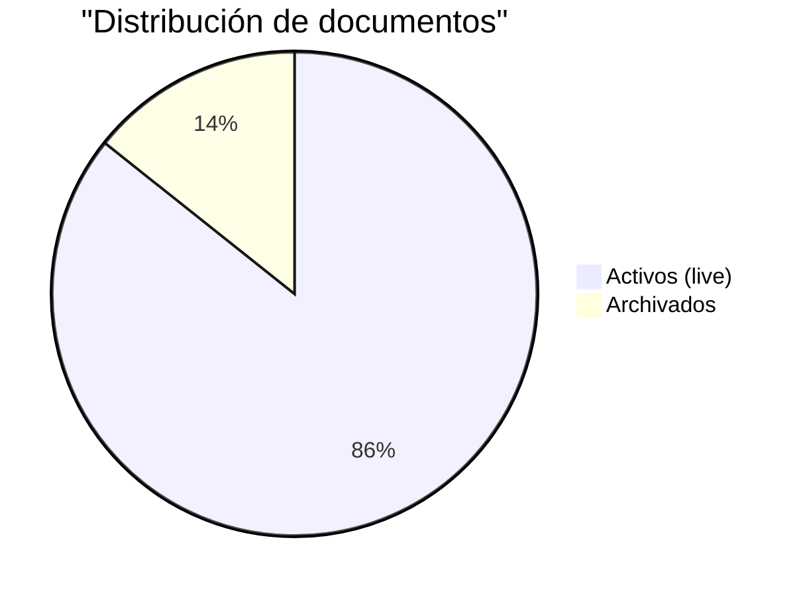

# Estado Operativo

**Última actualización:** 2025-10-23T22:34:25.689444+00:00  
**Commit referencia:** `4a622056`

---

## 📊 KPIs Documentación

| Métrica | Valor | Estado |
|---------|-------|--------|
| **Documentos activos** | 6 |  |
| **Documentos archivados** | 1 |  |
| **Total documentos** | 7 | — |

---

## 🔗 Enlaces Rápidos

- [📁 Documentos activos](/docs/live/)
- [🗄️ Archivo histórico](/docs/archive/)
- [⚙️ Gobernanza](/docs/_meta/governance.md)
- [✅ Validadores](/docs/_meta/CONTRIBUTING.md)

---

## 🚦 Estado de Servicios

| Servicio | Estado | Última Verificación |
|----------|--------|---------------------|
| **Preview** | ✅ Operativo | 2025-10-23T22:34:25.689444+00:00 |
| **Producción** | ✅ Operativo | 2025-10-23T22:34:25.689444+00:00 |
| **CI/CD** | ✅ Verde | Commit `4a622056` |

---

## 📈 Métricas Históricas

_(TODO: Integrar gráfico temporal con Chart.js o Mermaid)_



---

## 🔍 Detalles Técnicos

### Estructura de Carpetas

```
docs/
├── live/          # 6 documentos activos
├── archive/       # 1 documentos archivados
└── _meta/         # Metadatos y reportes
```

### Proceso de Actualización

1. **Generación:** `scripts/gen_status.py` → `docs/status.json`
2. **Renderizado:** `tools/render_status.py` → `apps/briefing/docs/status/index.md`
3. **Publicación:** MkDocs build → GitHub Pages / Cloudflare Pages
4. **Frecuencia:** Post-merge en `main` (automático)

### Validaciones Activas

- ✅ Strict frontmatter validation (CI blocking)
- ✅ Internal links checker
- ✅ External links health (timeout 5s)
- ✅ Tags uniqueness + lowercase
- ✅ Stale detection (weekly dry-run)

---

## 📝 Notas

- Este archivo es **generado automáticamente** por `tools/render_status.py`.
- No editar manualmente — cambios serán sobrescritos en próxima actualización.
- Para modificar plantilla: ver `tools/templates/status_page.md.j2` (o inline en script).

---

**Generado:** 2025-10-23T22:34:25.944206+00:00  
**Hash commit:** `4a622056`  
**Autor:** `render_status.py` (automated)