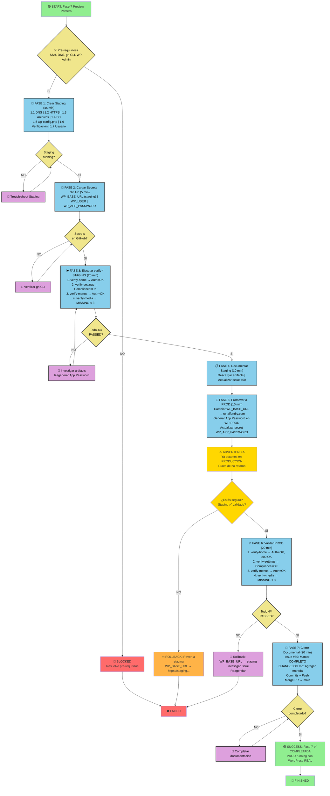

---

# 📊 DIAGRAM EXPLICADO

## Flujo Principal (Happy Path ✅)

```
START
  ↓
Verificar pre-requisitos
  ↓
FASE 1: Crear Staging (45 min)
  ├─ DNS + HTTPS + Archivos + BD + Config + Usuario
  └─ ✅ Staging running
  ↓
FASE 2: Cargar Secrets GitHub (5 min)
  └─ ✅ WP_BASE_URL=staging, credentials en GitHub
  ↓
FASE 3: Validar Staging (20 min)
  ├─ verify-home PASSED
  ├─ verify-settings PASSED
  ├─ verify-menus PASSED
  └─ verify-media PASSED (Auth=OK todos)
  ↓
FASE 4: Documentar Staging (10 min)
  └─ ✅ Artifacts descargados, Issue #50 actualizado
  ↓
⚠️ PUNTO CRÍTICO: Promover a PRODUCCIÓN
  ↓
FASE 5: Cambiar a PROD (10 min)
  └─ WP_BASE_URL=prod, App Password regenerado
  ↓
FASE 6: Validar PROD (20 min)
  ├─ verify-home PASSED
  ├─ verify-settings PASSED
  ├─ verify-menus PASSED
  └─ verify-media PASSED (Auth=OK todos)
  ↓
FASE 7: Cierre (20 min)
  ├─ Issue #50 → COMPLETADO
  ├─ CHANGELOG.md → entry agregada
  └─ PR → merged a main
  ↓
🎉 SUCCESS
```

## Flujos de Error (Troubleshooting)

### Si Pre-requisitos No OK
```
START → ❌ Pre-requisitos KO → Resuelve (SSH/DNS/CLI) → Reinicia
```

### Si Staging No Corre
```
FASE 1 → ❌ Staging no running → Troubleshoot → Reinicia FASE 1
```

### Si Staging Workflows Fallan
```
FASE 3 → ❌ Workflow FAILED → Ver artifacts → Regenerar App Password → Reinicia FASE 3
```

### Si Prod Workflows Fallan
```
FASE 6 → ❌ Workflow FAILED → ⏮️ ROLLBACK a Staging → Investigar → Reagendar
```

## Timeline Visual

```
STAGING PHASE (1h 20 min)
├─ FASE 1: 45 min [████████████████████████████████████]
├─ FASE 2:  5 min [██]
├─ FASE 3: 20 min [██████████]
└─ FASE 4: 10 min [█████]

PRODUCTION PHASE (50 min)
├─ FASE 5: 10 min [█████]
├─ FASE 6: 20 min [██████████]
└─ FASE 7: 20 min [██████████]

TOTAL: 2h 10 min (+ 30 min buffer = 2.5-3h nominal, up to 3.5-4.5h si hay troubleshooting)
```

## Criterios de Éxito (Definition of Done)

```
Staging ✅
  ☐ verify-home: 200 OK, Auth=OK
  ☐ verify-settings: Compliance=OK, Auth=OK
  ☐ verify-menus: OK, Auth=OK
  ☐ verify-media: OK, Auth=OK, MISSING ≤ 3

Production ✅
  ☐ verify-home: 200 OK, Auth=OK
  ☐ verify-settings: Compliance=OK, Auth=OK
  ☐ verify-menus: OK, Auth=OK
  ☐ verify-media: OK, Auth=OK, MISSING ≤ 3

Documentation ✅
  ☐ Issue #50: Staging section completed
  ☐ Issue #50: Production section completed
  ☐ CHANGELOG.md: Fase 7 entry added
  ☐ Artifacts: All 8 files downloaded (4 staging + 4 prod)

Seguridad ✅
  ☐ No secrets in git (grep check passed)
  ☐ No secrets in logs
  ☐ App Passwords rotated
  ☐ Backups verified

Finalización ✅
  ☐ PR merged to main
  ☐ Branch deleted
  ☐ Fase 7 status: COMPLETADA
```
