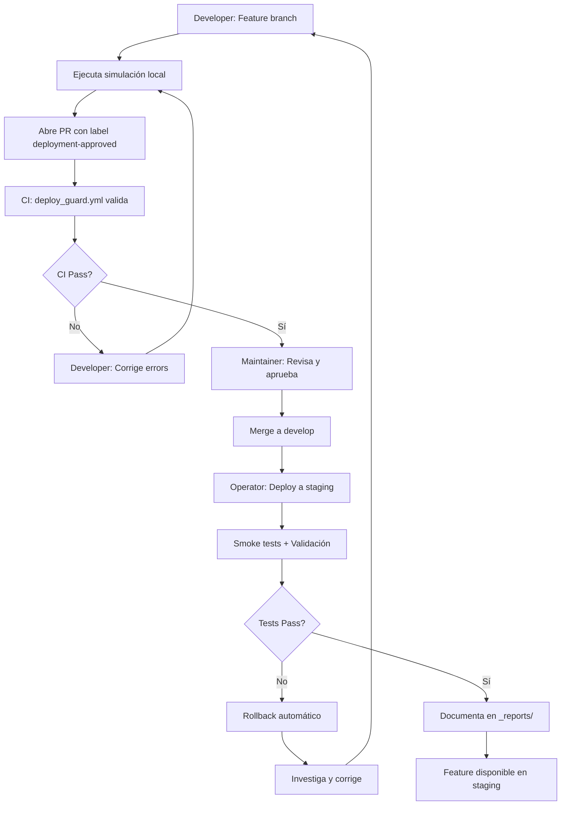
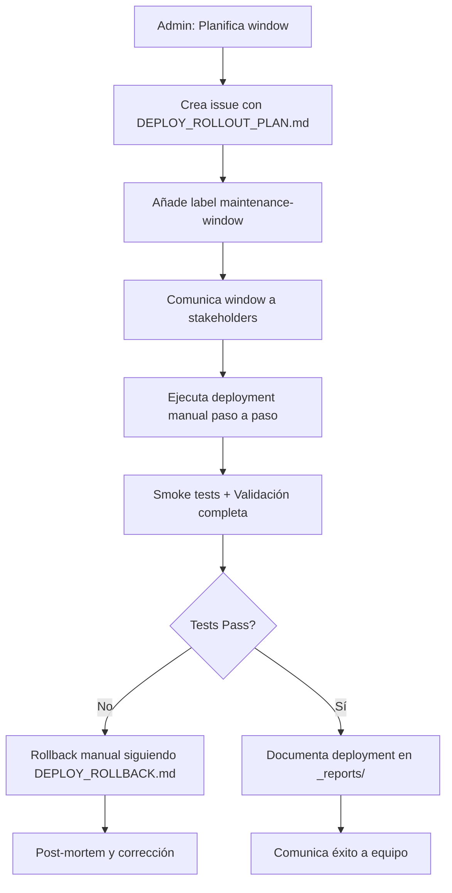

# 🚀 Deploy Framework — RunArt Foundry

> **Versión:** 1.0.0  
> **Última actualización:** 2025-01-29  
> **Estado:** Operativo (Staging habilitado + Seguridad reforzada)

---

## 📋 Tabla de Contenidos

1. [Resumen Ejecutivo](#resumen-ejecutivo)
2. [Canon y Configuración Base](#canon-y-configuración-base)
3. [Modos de Operación](#modos-de-operación)
4. [Variables de Entorno](#variables-de-entorno)
5. [Requisitos y Dependencias](#requisitos-y-dependencias)
6. [Roles y Responsabilidades](#roles-y-responsabilidades)
7. [Flujo de Trabajo](#flujo-de-trabajo)
8. [Checklist Operacional](#checklist-operacional)
9. [Logs y Auditoría](#logs-y-auditoría)
10. [Referencias](#referencias)

---

## Resumen Ejecutivo

El **Deploy Framework** de RunArt Foundry es un sistema de deployment seguro y auditado diseñado para:

- **Proteger producción** con defaults de solo lectura (`READ_ONLY=1`)
- **Simular cambios** antes de aplicarlos (`DRY_RUN=1`)
- **Habilitar staging** con validaciones de seguridad (`REAL_DEPLOY=1` solo para `TARGET=staging`)
- **Exigir aprobación explícita** para producción (label `maintenance-window` + revisión manual)
- **Generar auditoría completa** con logs, backups y reportes timestamped

### Principios de Diseño

1. **Security-First:** Todo deployment es simulación por defecto
2. **Explicit Enable:** Deployments reales requieren flags explícitos
3. **Staging-Only Real Deploys:** Producción bloqueada sin maintenance window
4. **Comprehensive Logging:** Cada operación genera logs detallados
5. **Automated Backups:** Backup automático antes de cualquier cambio real

---

## Canon y Configuración Base

### Tema Canonical

- **Nombre:** RunArt Base
- **Slug:** `runart-base`
- **Path en Staging:** `/homepages/7/d958591985/htdocs/staging/wp-content/themes/runart-base/`
- **Tipo:** Parent Theme (sin child theme en producción)
- **Versión mínima:** 1.0.0

### Entorno Staging

- **URL:** https://staging.runartfoundry.com
- **SSH Host:** `access958591985.webspace-data.io`
- **SSH User:** `u111876951`
- **WP Path:** `/homepages/7/d958591985/htdocs/staging`
- **Servidor:** Apache (IONOS)
- **Plugins activos:** Polylang, WP-CLI

### Entorno Producción

- **URL:** https://runartfoundry.com
- **Deployment:** **BLOQUEADO** sin `maintenance-window` label
- **Requisito adicional:** Revisión manual + aprobación de stakeholders

---

## Modos de Operación

### Modo 1: Simulación (Default)

```bash
READ_ONLY=1 DRY_RUN=1 REAL_DEPLOY=0 TARGET=staging ./tools/deploy/deploy_theme.sh
```

**Comportamiento:**
- Rsync con `--dry-run`: muestra archivos que se modificarían
- WP-CLI comandos se registran pero no ejecutan
- No genera backup
- Output: reporte de simulación en `_reports/deploy_logs/DEPLOY_DRYRUN_*.md`

**Uso:** Validación previa a PR, testing de scripts, CI automation

---

### Modo 2: Real Deployment a Staging

```bash
READ_ONLY=0 DRY_RUN=0 REAL_DEPLOY=1 TARGET=staging ./tools/deploy/deploy_theme.sh
```

**Comportamiento:**
- Genera backup timestamped en `_reports/deploy_logs/backups/`
- Ejecuta rsync sin `--dry-run`: copia archivos realmente
- Ejecuta comandos WP-CLI en servidor remoto
- Output: reporte completo en `_reports/deploy_logs/DEPLOY_REAL_*.md`

**Requisitos:**
- Label `deployment-approved` en PR
- SSH key configurada (`~/.ssh/id_rsa_ionos`)
- Entorno validado por `staging_env_loader.sh`

**Validaciones automáticas:**
- Abort si `THEME_DIR ≠ runart-base`
- Abort si modificaciones en `wp-content/uploads/` sin label `media-review`
- Abort si no existe backup previo válido

---

### Modo 3: Real Deployment a Producción (BLOQUEADO)

```bash
READ_ONLY=0 DRY_RUN=0 REAL_DEPLOY=1 TARGET=production ./tools/deploy/deploy_theme.sh
```

**Comportamiento:**
- **Script ABORTS IMMEDIATELY** con mensaje de error
- Requiere label `maintenance-window` + aprobación manual
- Deployment manual con checklist completo (ver `DEPLOY_ROLLOUT_PLAN.md`)

**Justificación:** Producción requiere window planificado, comunicación a usuarios, rollback plan

---

## Variables de Entorno

### Variables Core

| Variable | Default | Descripción | Valores Válidos |
|----------|---------|-------------|-----------------|
| `READ_ONLY` | `1` | Modo solo lectura (simulación) | `0`, `1` |
| `DRY_RUN` | `1` | Rsync con `--dry-run` | `0`, `1` |
| `REAL_DEPLOY` | `0` | Habilita deployment real | `0`, `1` |
| `TARGET` | `staging` | Entorno destino | `staging`, `production` |
| `THEME_DIR` | `runart-base` | Tema a deployar (forzado) | `runart-base` |
| `SKIP_SSH` | `1` | Omite validación SSH (CI only) | `0`, `1` |

### Variables Adicionales

| Variable | Default | Descripción |
|----------|---------|-------------|
| `BACKUP_RETENTION` | `7` | Días de retención de backups |
| `LOG_LEVEL` | `INFO` | Nivel de detalle en logs (`DEBUG`, `INFO`, `WARN`, `ERROR`) |
| `SMOKE_TESTS` | `1` | Ejecuta smoke tests post-deploy |
| `ROLLBACK_ON_FAIL` | `1` | Rollback automático si smoke tests fallan |

### Configuración de Entorno

Cargar variables desde archivo:

```bash
source ~/.runart_staging_env
./tools/deploy/deploy_theme.sh
```

Ejemplo de `~/.runart_staging_env`:

```bash
export STAGING_HOST="access958591985.webspace-data.io"
export STAGING_USER="u111876951"
export STAGING_WP_PATH="/homepages/7/d958591985/htdocs/staging"
export SSH_KEY_PATH="$HOME/.ssh/id_rsa_ionos"
```

---

## Requisitos y Dependencias

### Sistema Base

- **Bash:** ≥ 4.0
- **Git:** ≥ 2.20
- **OpenSSH:** ≥ 7.4
- **rsync:** ≥ 3.1

### Herramientas Deploy

- **sshpass:** Para autenticación SSH (opcional si se usa key)
- **jq:** Para parsing de JSON en logs
- **tar/gzip:** Para generación de backups

### Servidor Remoto

- **WP-CLI:** ≥ 2.4 (instalado en servidor IONOS)
- **Apache:** ≥ 2.4
- **PHP:** ≥ 7.4
- **MySQL:** ≥ 5.7

### Permisos y Accesos

- **SSH Key:** `~/.ssh/id_rsa_ionos` con permisos `600`
- **Known Hosts:** Entrada para `access958591985.webspace-data.io`
- **GitHub Token:** Con scopes `repo`, `workflow` (para PR creation)

---

## Roles y Responsabilidades

### Developer

- Crea feature branch con cambios en `runart-base/`
- Ejecuta simulaciones locales (`DRY_RUN=1`)
- Abre PR con label `deployment-approved` si necesita deploy
- Revisa logs de CI guard (`deploy_guard.yml`)

### Maintainer

- Revisa PR con cambios en tema
- Valida que cambios no afecten producción directamente
- Aprueba PR si simulación es exitosa
- Ejecuta deployment a staging tras merge a `develop`

### Operator (Staging Deploy)

- Verifica estado de staging con `staging_env_loader.sh`
- Ejecuta deployment real: `REAL_DEPLOY=1 TARGET=staging ./tools/deploy/deploy_theme.sh`
- Valida resultado con smoke tests
- Documenta deployment en `_reports/deploy_logs/`

### Admin (Production Deploy)

- Planifica maintenance window con stakeholders
- Crea issue con checklist de `DEPLOY_ROLLOUT_PLAN.md`
- Añade label `maintenance-window` a PR
- Ejecuta deployment manual con revisión paso a paso
- Valida producción con checklist completo
- Comunica resultado a equipo

---

## Flujo de Trabajo

### Workflow Típico: Feature → Staging



### Workflow Excepcional: Staging → Production



---

## Checklist Operacional

### Pre-Deploy (Simulación)

- [ ] Branch actualizada con `develop`
- [ ] Variables de entorno cargadas (`source ~/.runart_staging_env`)
- [ ] Simulación ejecutada: `DRY_RUN=1 ./tools/deploy/deploy_theme.sh`
- [ ] Logs revisados en `_reports/deploy_logs/DEPLOY_DRYRUN_*.md`
- [ ] Sin errores de rsync o validación

### Pre-Deploy (Real a Staging)

- [ ] Simulación exitosa (paso anterior)
- [ ] SSH key configurada y validada
- [ ] Label `deployment-approved` en PR
- [ ] PR mergeado a `develop`
- [ ] Backup manual opcional generado: `tools/backup_staging.sh`

### Deploy Execution (Staging)

- [ ] Comando ejecutado: `REAL_DEPLOY=1 TARGET=staging ./tools/deploy/deploy_theme.sh`
- [ ] Backup automático generado en `_reports/deploy_logs/backups/`
- [ ] Rsync completado sin errores
- [ ] WP-CLI comandos ejecutados correctamente
- [ ] Smoke tests passed

### Post-Deploy (Validation)

- [ ] Staging accesible: https://staging.runartfoundry.com
- [ ] Tema activo: RunArt Base (`wp theme list --status=active`)
- [ ] Páginas principales cargan (Home, About, Contact)
- [ ] Polylang funcional (EN/ES switch)
- [ ] Sin errores en logs de Apache (`tail -f error_log`)
- [ ] Reporte generado en `_reports/deploy_logs/DEPLOY_REAL_*.md`

### Pre-Deploy (Production) — SOLO CON MAINTENANCE WINDOW

- [ ] Issue creado con checklist de `DEPLOY_ROLLOUT_PLAN.md`
- [ ] Label `maintenance-window` añadido
- [ ] Comunicación enviada a stakeholders (email/Slack)
- [ ] Window programado (fecha/hora comunicada)
- [ ] Backup completo de producción generado
- [ ] Rollback plan documentado en `DEPLOY_ROLLBACK.md`
- [ ] Smoke tests preparados en staging

### Deploy Execution (Production)

- [ ] Deployment ejecutado manualmente paso a paso
- [ ] Cada comando documentado en reporte timestamped
- [ ] Validación manual tras cada fase
- [ ] Smoke tests ejecutados en producción
- [ ] Monitoreo activo de logs y métricas

### Post-Deploy (Production)

- [ ] Producción accesible y funcional
- [ ] Smoke tests passed completamente
- [ ] Logs sin errores críticos
- [ ] Métricas normales (response time, uptime)
- [ ] Comunicación de éxito a stakeholders
- [ ] Reporte final documentado
- [ ] Post-mortem si hubo issues (opcional)

---

## Logs y Auditoría

### Ubicación de Logs

```
_reports/deploy_logs/
├── DEPLOY_DRYRUN_20250129T143022Z.md      # Simulación
├── DEPLOY_REAL_20250129T150845Z.md        # Deployment real a staging
├── DEPLOY_FRAMEWORK_STATUS_20250129.md    # Estado del framework
├── backups/
│   ├── staging_20250129T150840Z.tar.gz    # Backup pre-deploy
│   └── staging_20250129T150840Z.sha256    # Checksum
└── rollbacks/
    └── ROLLBACK_20250129T151200Z.md       # Registro de rollback
```

### Formato de Reporte

Cada reporte incluye:

1. **Metadata:** Timestamp, usuario, target, modo
2. **Configuration:** Variables de entorno activas
3. **Validation:** Checklist de requisitos
4. **Execution Log:** Output completo de comandos
5. **Results Summary:** Archivos modificados, timing, status
6. **Backup Info:** Path y checksum de backup generado
7. **Next Steps:** Acciones recomendadas

### Auditoría y Compliance

- **Retención:** Logs mantenidos por 90 días (configurable)
- **Versionado:** Logs commiteados a repo (excepto backups)
- **Review:** PR requiere revisión de logs por maintainer
- **Traceability:** Cada deployment linkea a PR/commit específico

---

## Referencias

### Documentación Relacionada

- **[DEPLOY_ROLLOUT_PLAN.md](./DEPLOY_ROLLOUT_PLAN.md):** Template para planes de deployment autorizados
- **[DEPLOY_ROLLBACK.md](./DEPLOY_ROLLBACK.md):** Procedimientos de rollback
- **[DEPLOY_FAQ.md](./DEPLOY_FAQ.md):** Preguntas frecuentes
- **[../Deployment_Master.md](../Deployment_Master.md):** Referencia histórica (pre-framework)
- **[../_meta/governance.md](../_meta/governance.md):** Políticas de staging y deployment

### Scripts y Herramientas

- **`tools/deploy/deploy_theme.sh`:** Script principal de deployment
- **`tools/staging_env_loader.sh`:** Validador de entorno staging
- **`tools/backup_staging.sh`:** Generador de backups manuales (opcional)
- **`.github/workflows/deploy_guard.yml`:** CI guard para validación de políticas

### Reportes de Estado

- **`_reports/TEMA_ACTIVO_STAGING_20251029.md`:** Verificación de tema activo
- **`_reports/CI_FREEZE_POLICY_20251029.md`:** Política de freeze operacional
- **`_reports/REFERENCIAS_TEMA_CORREGIDAS_20251029.md`:** Inventario de normalización

---

## Changelog

### [1.0.0] - 2025-01-29

#### Añadido
- Framework completo de deployment con modos Simulación/Real
- Documentación canon-al completa
- Script `deploy_theme.sh` con validaciones de seguridad
- CI guard `deploy_guard.yml`
- Sistema de backups automáticos
- Logs y auditoría timestamped

#### Seguridad
- Defaults seguros: `READ_ONLY=1`, `DRY_RUN=1`, `REAL_DEPLOY=0`
- Producción bloqueada sin `maintenance-window`
- Validación de tema forzada (`runart-base`)
- Media changes requieren label `media-review`

---

**Mantenido por:** RunArt Foundry Team  
**Contacto:** [Crear issue](https://github.com/RunArtFoundry/runart-foundry/issues/new)  
**Licencia:** Proprietary — RunArt Foundry
