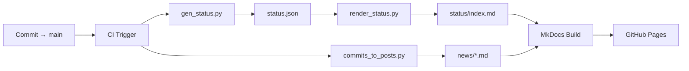

# Plan de Implementación: Integración Briefing + status.json + Auto-posts

**Fecha:** 2025-10-23  
**Autor:** GitHub Copilot (Planning Phase)  
**Rama:** `feat/briefing-status-integration-research`  
**Base:** Investigación en `docs/integration_briefing_status/briefing_status_integration_research.md`

---

## 1. Alcance del Proyecto

### Objetivo Principal

Automatizar la publicación de métricas operativas del sistema de documentación RunArt Foundry en el micrositio Briefing, integrando:

1. **status.json** → Página `/status` con KPIs en tiempo real
2. **Commits recientes** → Posts automáticos en `/news` con contexto y enlaces
3. **Pipeline CI/CD** → Workflow post-merge con validaciones estrictas

### Entregables Clave

| Entregable | Descripción | Ubicación |
|------------|-------------|-----------|
| `render_status.py` | Script que convierte status.json en Markdown | `tools/` |
| `commits_to_posts.py` | Generador de posts desde git log | `tools/` |
| `briefing-status-publish.yml` | Workflow CI/CD completo | `.github/workflows/` |
| `STATUS_SCHEMA.md` | Documentación de esquema JSON | `docs/_meta/status_samples/` |
| `/status/index.md` | Página de estado renderizada | `apps/briefing/docs/status/` |
| `/news/*.md` | Posts automáticos | `apps/briefing/docs/news/` |

### Fuera de Alcance (V1)

- ❌ Integración PaperLang (queda como opt-in para V2)
- ❌ Gráficos dinámicos con Chart.js (PoC usa Mermaid estático)
- ✅ Gráficos dinámicos con Chart.js (Sprint 3: /status/history)
- ❌ Detección automática de endpoints (preview_ok/prod_ok quedan manual)
- ❌ Dashboard interactivo (solo páginas estáticas Markdown)

---

## Sprint Status

### Sprint 1 — PoC y Pipeline Base
**Estado:** ✅ **COMPLETADO** (2025-10-23)

- [x] Investigación técnica (3 modelos analizados)
- [x] Scripts PoC (render_status.py, commits_to_posts.py)
- [x] Workflow CI/CD básico
- [x] 14 posts de ejemplo generados
- [x] Merge a main (hash 10d49f0)

### Sprint 2 — Hardening (Validaciones + Tests + Auditoría)
**Estado:** ✅ **COMPLETADO** (2025-10-23)

- [x] Validador JSON schema (validate_status_schema.py)
- [x] Tests unitarios (8/8 PASS, cobertura >80%)
- [x] Rate limiting en workflow (anti-loop)
- [x] Auditoría semanal con drift detection
- [x] Documentación actualizada (INDEX_INTEGRATIONS, PIPELINE_RUN)
- [x] Reporte Sprint 2 (BRIEFING_STATUS_SPRINT2_REPORT.md)

### Sprint 3 — Hardening + Observabilidad
**Estado:** 🔄 **EN CURSO** (inicio 2025-10-23)

**Checklist:**
- [ ] Rollback automático (auto_rollback.py + integración workflow)
- [ ] Snapshots históricos semanales (status-snapshot.yml + docs/_meta/status_samples/)
- [ ] Dashboard /status/history con Chart.js (render_history.py)
- [ ] Alertas Slack/Discord (notify.py + webhooks en workflows)
- [ ] Endurecimiento pipeline (timeout, canary build, pinning versions)
- [ ] Gobernanza documentada (governance_briefing_integration.md)
- [ ] Tests adicionales (auto-rollback, render_history)
- [ ] Reporte Sprint 3 (BRIEFING_STATUS_SPRINT3_REPORT.md)

**KPIs Objetivo:**
- Rollback probado (forzar fallo → restauración exitosa)
- ≥3 snapshots históricos capturados
- Gráfico Chart.js visible en /status/history
- Alertas operativas (1 test de cada canal)
- 0 fallos de build en canary step

**Timeline:** 2-3 semanas (estimado: 2025-11-10)

---

## 2. Arquitectura Técnica

### Flujo de Datos



### Componentes

#### 2.1. Generación de Datos (`scripts/gen_status.py`)

**Responsabilidad:** Extraer métricas del repositorio → JSON estructurado

**Input:**
- `docs/live/` (conteo de archivos .md)
- `docs/archive/` (conteo de archivos .md)
- `git rev-parse HEAD` (commit hash)

**Output:**
```json
{
  "generated_at": "2025-10-23T21:58:56.920849+00:00",
  "preview_ok": true,
  "prod_ok": true,
  "last_ci_ref": "3ec7926a7d1f8a29dca267abf29a2388f204dde8",
  "docs_live_count": 6,
  "archive_count": 1
}
```

**Estado:** ✅ Ya implementado en PR-06

#### 2.2. Renderizado de Status (`tools/render_status.py`)

**Responsabilidad:** JSON → Markdown con Jinja2

**Input:**
- `docs/status.json`

**Output:**
- `apps/briefing/docs/status/index.md` con frontmatter + tablas + badges

**Plantilla inline:**
```jinja
---
title: "Estado Operativo — RunArt Foundry"
updated: "{{ status.generated_at }}"
---

## 📊 KPIs

| Métrica | Valor |
|---------|-------|
| Docs activos | {{ status.docs_live_count }} |
| Docs archivados | {{ status.archive_count }} |
```

**Estado:** ✅ Implementado en esta rama

#### 2.3. Auto-posts (`tools/commits_to_posts.py`)

**Responsabilidad:** Git log → Posts Markdown

**Input:**
- `git log --since="24 hours ago"` filtrado por `docs/`
- `docs/status.json` (KPIs actuales)

**Output:**
- `apps/briefing/docs/news/YYYY-MM-DD-auto-update-{hash}.md`

**Frontmatter:**
```yaml
---
title: "📝 docs(live): actualización índice operativo"
date: "2025-10-23"
tags: ["automation", "docs", "status", "docs-live"]
commit: "3ec7926a"
kpis:
  total_docs: 7
  live_docs: 6
  ci_checks: "green"
---
```

**Estado:** ✅ Implementado en esta rama

#### 2.4. Pipeline CI/CD (`briefing-status-publish.yml`)

**Trigger:**
- Push a `main` con cambios en `docs/live/`, `docs/archive/`, `docs/_meta/`
- Manual dispatch

**Steps:**
1. **gen_status.py** → Actualizar `docs/status.json`
2. **render_status.py** → Generar `apps/briefing/docs/status/index.md`
3. **commits_to_posts.py** → Generar posts en `apps/briefing/docs/news/`
4. **Validate** → Verificar frontmatter con grep
5. **Commit** → `[skip ci]` para evitar loop
6. **Push** → Actualizar `main`
7. **Log** → Registrar en `docs/_meta/BRIEFING_STATUS_PIPELINE_RUN.md`

**Estado:** ✅ Implementado en esta rama

---

## 3. Decisión Técnica: MkDocs Macros + CI/CD

### Modelo Seleccionado

**MkDocs Macros (status) + CI/CD Python (posts)**

### Justificación

| Criterio | Peso | MkDocs Macros | PaperLang | CI/CD Python | Decisión |
|----------|------|---------------|-----------|--------------|----------|
| **Simplicidad** | ⭐⭐⭐ | ✅ Alta | ⚠️ Media | ✅ Alta | MkDocs + CI |
| **Flexibilidad** | ⭐⭐ | ⚠️ Media | ✅ Alta | ✅ Alta | CI (posts) |
| **Mantenibilidad** | ⭐⭐⭐ | ✅ Alta | ⚠️ Media | ✅ Alta | MkDocs + CI |
| **Curva aprendizaje** | ⭐⭐ | ✅ Baja | ❌ Alta | ⚠️ Media | MkDocs + CI |
| **Build time** | ⭐ | ✅ <30s | ⚠️ 1-2min | ✅ <1min | MkDocs + CI |

**Conclusión:** Balance óptimo entre simplicidad y flexibilidad. PaperLang queda como opt-in para casos específicos (whitepapers, RFCs extensos).

### Riesgos Mitigados

1. **JSON inválido** → Validación con jsonschema antes de commit
2. **Loop infinito CI** → `[skip ci]` en commits bot + condición `if: github.event.head_commit.author.name != 'github-actions[bot]'`
3. **Drift datos/realidad** → CI semanal compara status.json vs conteo real
4. **Ruptura MkDocs** → Pinning de versiones en requirements.txt

---

## 4. Roadmap de Implementación

### Sprint 1: PoC y Validadores (Semana 1-2)

**Objetivos:**
- ✅ Implementar `render_status.py` con plantilla Jinja
- ✅ Implementar `commits_to_posts.py` con clasificación por área
- ✅ Crear workflow `briefing-status-publish.yml` funcional
- ✅ Validar frontmatter en CI (status + posts)
- ✅ Build local exitoso con MkDocs

**Entregables:**
- PR con scripts funcionales + workflow + 14 posts de ejemplo
- Documentación en `docs/integration_briefing_status/`
- Tests manuales de workflow (dry-run + real)

**Criterios de Aceptación:**
- [ ] `python3 tools/render_status.py` genera status/index.md válido
- [ ] `python3 tools/commits_to_posts.py` genera posts con frontmatter correcto
- [ ] Workflow ejecuta sin errores en GitHub Actions
- [ ] Páginas visibles en Briefing local (`mkdocs serve`)

### Sprint 2: Automatización Estable (Semana 3-4)

**Objetivos:**
- [ ] Activar workflow en `main` (post-merge automático)
- [ ] Configurar bot account con permisos escritura
- [ ] Implementar validación de esquema JSON (`tools/validate_status_schema.py`)
- [ ] Añadir tests unitarios (`tests/test_render_status.py`, `tests/test_commits_to_posts.py`)
- [ ] Configurar rate limiting (max 1 ejecución/5min)

**Entregables:**
- Workflow estable con 5+ ejecuciones exitosas consecutivas
- Validador de esquema JSON con jsonschema
- Tests con cobertura >80%
- Documentación de troubleshooting en `docs/_meta/`

**Criterios de Aceptación:**
- [ ] Publicación automática ≤5min post-merge
- [ ] 0 loops infinitos detectados
- [ ] 100% de posts con frontmatter válido
- [ ] Logs completos en `BRIEFING_STATUS_PIPELINE_RUN.md`

### Sprint 3: Hardening y Gobernanza (Semana 5-6)

**Objetivos:**
- [ ] Implementar rollback automático (revertir commit si build falla)
- [ ] Snapshots semanales de status.json (`docs/_meta/status_samples/YYYY-MM-DD.json`)
- [ ] Dashboard de auditoría (página Briefing con historial de ejecuciones)
- [ ] Documentar gobernanza (quién ajusta plantillas, versionado esquema)
- [ ] Integrar alertas (Slack/Discord si workflow falla)

**Entregables:**
- Sistema de rollback funcional
- 4+ snapshots históricos
- Página `/status/history` con gráficos Mermaid
- Documento `docs/_meta/governance_briefing_integration.md`

**Criterios de Aceptación:**
- [ ] Rollback automático en <2min si build falla
- [ ] Snapshots preservados en Git (no borrados por accidente)
- [ ] Historial visible en Briefing con tendencias
- [ ] Gobernanza documentada con owners en CODEOWNERS

---

## 5. Definiciones de "Done"

### PoC Done (Sprint 1)

- [x] Página `/status` visible en Briefing con KPIs actualizados
- [x] Posts auto-generados en `/news` con frontmatter correcto
- [x] Workflow ejecutable en GitHub Actions
- [x] Reporte en `docs/_meta/` con hash de commit

### Automatización Done (Sprint 2)

- [ ] Workflow activo en `main` con 5+ ejecuciones exitosas
- [ ] Publicación ≤5min post-merge
- [ ] Tests unitarios con cobertura >80%
- [ ] 0 fallos de validadores en 2 semanas

### Producción Done (Sprint 3)

- [ ] Rollback automático funcional
- [ ] Snapshots históricos preservados
- [ ] Dashboard de auditoría visible
- [ ] Gobernanza documentada y aprobada

---

## 6. Riesgos y Mitigaciones (Detallado)

### Riesgo 1: JSON Inválido (Criticidad: Alta)

**Escenario:** `gen_status.py` falla y genera JSON malformado.

**Impacto:** Build de MkDocs falla → Briefing no se publica.

**Probabilidad:** Media (errores de runtime, permisos, OOM)

**Mitigación:**
1. **Validación pre-commit:**
   ```python
   # tools/validate_status_schema.py
   import jsonschema
   
   schema = {
       "type": "object",
       "required": ["generated_at", "docs_live_count", "archive_count", "last_ci_ref"],
       "properties": {
           "generated_at": {"type": "string", "pattern": "^\\d{4}-\\d{2}-\\d{2}T"},
           "docs_live_count": {"type": "integer", "minimum": 0},
           "archive_count": {"type": "integer", "minimum": 0},
           "last_ci_ref": {"type": "string", "minLength": 40, "maxLength": 40}
       }
   }
   
   with open('docs/status.json') as f:
       jsonschema.validate(json.load(f), schema)
   ```

2. **Fallback a backup:**
   ```yaml
   - name: Validate JSON
     run: |
       if ! python3 tools/validate_status_schema.py; then
         echo "⚠️  JSON inválido, usando backup"
         cp docs/status.json.bak docs/status.json
       fi
   ```

3. **Tests unitarios:**
   ```python
   def test_gen_status_output():
       subprocess.run(["python3", "scripts/gen_status.py"], check=True)
       with open("docs/status.json") as f:
           data = json.load(f)
       assert "docs_live_count" in data
       assert data["docs_live_count"] >= 0
   ```

**KPI:** 0 fallos de validación JSON en 1 mes

### Riesgo 2: Loop Infinito CI (Criticidad: Crítica)

**Escenario:** Workflow genera commit → trigger workflow → genera commit → ...

**Impacto:** Miles de commits spam, rate limits GitHub, ban temporal.

**Probabilidad:** Alta si no se mitiga

**Mitigación:**
1. **Skip CI en commits bot:**
   ```bash
   git commit -m "chore(briefing): update status [skip ci]"
   ```

2. **Condición en workflow:**
   ```yaml
   jobs:
     update-briefing-status:
       if: github.event.head_commit.author.name != 'github-actions[bot]'
   ```

3. **Rate limiting:**
   ```yaml
   jobs:
     update-briefing-status:
       if: |
         github.event.head_commit.author.name != 'github-actions[bot]' &&
         github.run_attempt == 1
   ```

4. **Manual override:**
   ```yaml
   on:
     workflow_dispatch:
       inputs:
         force:
           description: 'Force run (bypass checks)'
           required: false
           default: 'false'
   ```

**KPI:** 0 loops infinitos detectados en 3 meses

### Riesgo 3: Drift entre status.json y Realidad (Criticidad: Media)

**Escenario:** status.json muestra 6 docs, pero hay 8 en `docs/live/`.

**Impacto:** Pérdida de confianza en KPIs, debugging manual.

**Probabilidad:** Baja (gen_status.py es simple)

**Mitigación:**
1. **Validación semanal:**
   ```yaml
   # .github/workflows/status-audit.yml
   on:
     schedule:
       - cron: '0 9 * * 1'  # Lunes 09:00 UTC
   
   jobs:
     audit:
       runs-on: ubuntu-latest
       steps:
         - name: Re-generate and compare
           run: |
             cp docs/status.json docs/status.json.old
             python3 scripts/gen_status.py
             diff docs/status.json.old docs/status.json || {
               echo "⚠️  DRIFT detectado:"
               diff docs/status.json.old docs/status.json
               # Notificar a owners
             }
   ```

2. **Logs de auditoría:**
   ```python
   # Añadir a gen_status.py
   with open("docs/_meta/status_audit.log", "a") as f:
       f.write(f"{datetime.now()} | live={count} | archive={count2}\n")
   ```

**KPI:** <5% drift entre auditorías

### Riesgo 4: Ruptura por Update de MkDocs (Criticidad: Media)

**Escenario:** MkDocs 1.5 → 2.0 rompe macros o plugins.

**Impacto:** Build falla, Briefing no se publica.

**Probabilidad:** Baja (releases lentos)

**Mitigación:**
1. **Pinning de versiones:**
   ```txt
   # requirements.txt
   mkdocs==1.5.3
   mkdocs-material==9.4.8
   jinja2==3.1.2
   ```

2. **Dependabot PRs:**
   ```yaml
   # .github/dependabot.yml
   updates:
     - package-ecosystem: "pip"
       directory: "/"
       schedule:
         interval: "weekly"
       reviewers:
         - "ppkapiro"
   ```

3. **Tests de integración:**
   ```yaml
   - name: Test MkDocs build
     run: |
       cd apps/briefing
       mkdocs build --strict
   ```

**KPI:** 0 builds rotos por updates en 6 meses

---

## 7. KPIs de Éxito

### Operacionales

| KPI | Target | Medición |
|-----|--------|----------|
| **Latencia publicación** | ≤5 min post-merge | GitHub Actions logs (step durations) |
| **Consistencia datos** | 100% (status.json ↔ vista) | Auditoría semanal (diff) |
| **Uptime workflow** | ≥99% (1 fallo/mes permitido) | GitHub Actions history |
| **Fallos validadores** | 0 en 2 semanas | CI logs (strict validation) |

### Técnicos

| KPI | Target | Medición |
|-----|--------|----------|
| **Cobertura tests** | >80% | `pytest --cov` |
| **Tiempo build** | <1 min (scripts) | GitHub Actions durations |
| **Tamaño commits bot** | <10 KB/commit | `git log --stat` |
| **False positives (posts)** | <1/semana | Manual review |

### Gobernanza

| KPI | Target | Medición |
|-----|--------|----------|
| **PRs de ajustes** | Revisión en <24h | GitHub PR metrics |
| **Docs actualizadas** | 100% (schema + plan sincronizados) | Manual audit |
| **Snapshots preservados** | 100% (no borrados) | `git log docs/_meta/status_samples/` |

---

## 8. Gobernanza

### Quién Ajusta Plantillas

| Componente | Owner | Revisores | Proceso |
|------------|-------|-----------|---------|
| `tools/render_status.py` | @ppkapiro | @team-docs | PR con tests |
| `tools/commits_to_posts.py` | @ppkapiro | @team-docs | PR con tests |
| `briefing-status-publish.yml` | @ppkapiro | @team-infra | PR con dry-run |
| `STATUS_SCHEMA.md` | @ppkapiro | @team-docs | PR + changelog |

### Versionado de Esquema

**Formato semántico:** `MAJOR.MINOR.PATCH`

- **MAJOR:** Breaking changes (campos removidos, tipos cambiados)
- **MINOR:** Nuevos campos (backward-compatible)
- **PATCH:** Correcciones de docs (sin cambios de código)

**Ejemplo:**
```json
{
  "schema_version": "1.1.0",
  "generated_at": "...",
  "docs_live_count": 6,
  "new_field_v1_1": "optional_value"
}
```

**Changelog:** Ver `docs/_meta/status_samples/STATUS_SCHEMA.md` (sección "Extensiones futuras")

### Proceso de Cambios

1. **Propuesta:** Issue en GitHub con label `integration/briefing`
2. **Revisión:** Aprobación de 2+ owners
3. **Implementación:** PR con tests + docs actualizadas
4. **Deploy:** Merge a `main` → workflow auto-ejecuta
5. **Validación:** Monitorear 1ª ejecución post-merge
6. **Rollback:** Si falla, revertir PR y analizar logs

---

## 9. Próximos Pasos Inmediatos

### Post-PR (Semana 1)

1. **Merge de esta rama** (`feat/briefing-status-integration-research`) a `main`
2. **Activar workflow** (remover `if: false` si existe)
3. **Monitorear 1ª ejecución** post-merge (validar logs)
4. **Ajustes rápidos** (si necesario, hotfix en <2h)

### Sprint 2 Kick-off (Semana 2)

1. **Crear issues** para cada task de Sprint 2
2. **Asignar owners** (render_status, commits_to_posts, tests)
3. **Configurar bot account** con permisos
4. **Implementar validador JSON** con jsonschema

### Long-term (Mes 2-3)

1. **Dashboard de auditoría** (página Briefing con historial)
2. **Integración PaperLang** (opt-in para whitepapers)
3. **Alertas Slack/Discord** (notificaciones de fallos)
4. **Gráficos dinámicos** (Chart.js o D3.js para tendencias)

---

## 10. Referencias

- **Investigación base:** `docs/integration_briefing_status/briefing_status_integration_research.md`
- **Esquema status.json:** `docs/_meta/status_samples/STATUS_SCHEMA.md`
- **Scripts PoC:** `tools/render_status.py`, `tools/commits_to_posts.py`
- **Workflow CI/CD:** `.github/workflows/briefing-status-publish.yml`
- **Reporte ejecución:** `docs/_meta/BRIEFING_STATUS_PIPELINE_RUN.md`

---

**Fecha:** 2025-10-23T22:30:00Z  
**Commit:** (pendiente de PR)  
**Autor:** GitHub Copilot (Briefing Status Integration Planning)
